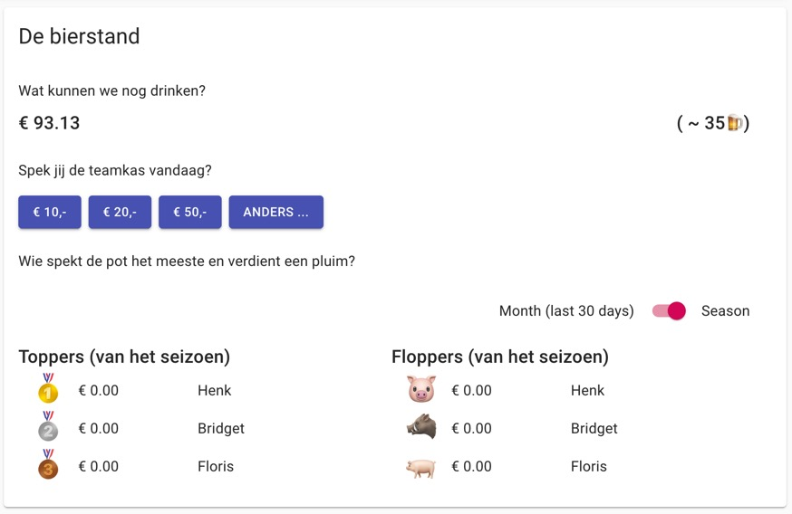
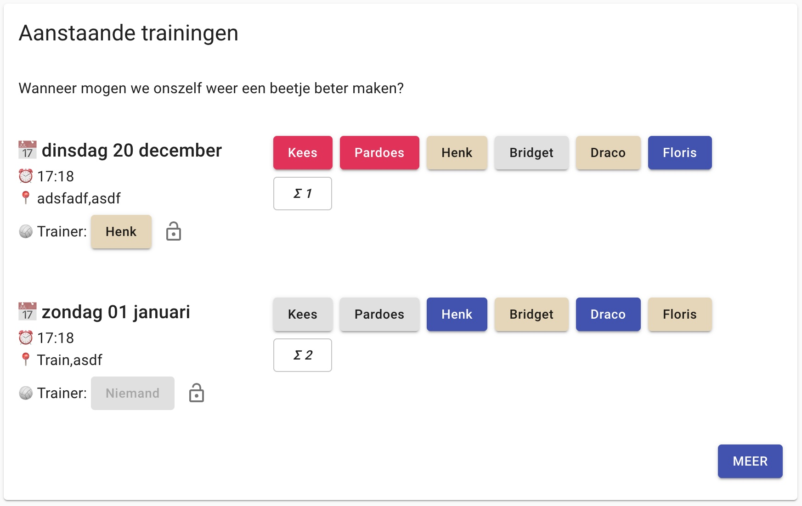
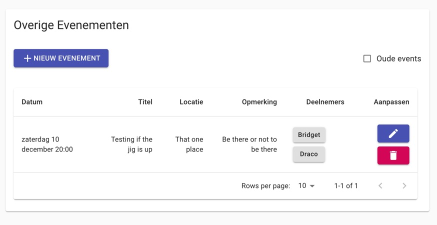

<div align="center">
    <h1>teambalance</h1>
    
    <p>A pet project to monitor event attendance ✅, and team expenses 💸 on beer 🍻 and borrels 🍸🍟</p>
</div>

## What it does

Teambalance allows groups of people that meet regularly (such as sports team) to plan their events' attendance, and have
a shared wallet, or 'pot' in Dutch to pay for expenses around those events. go out together often to have a kind of
shared wallet or 'pot' in Dutch. With everybody being able to chip in and see what transactions went out, it allows the
bills to be paid from a single bank account.

As it is becoming more uncommon to use cash, and bars and clubs allow card payments more often, the need for a digital
money pool is becoming more and more apparent.

Team balance started off a hobby project and technology explorer (see setup).

### Use case

[Tovo](https://tovo.nl/)'s Heren 5 is a volleybal team in Utrecht, The Netherlands. They have a training on a weekly
basis, and play a competion is a poule of 11, meaning they'll play 20 matches per year. What's more, there are some
other (obligatory) events for the team to meet. During events (most notably the matches), members meet in the canteen of
the sports hall before and after the match for some drinks.

As everybody in the team has a role, e.g. outside hitter, libero and setter. For each event, each position should be
filled, and keeping track of attendance beforehand makes it easy to spot when substitutes from other teams are needed.

<!-- attendence overview -->

Oftentimes, canteen allow teams to have a tab, which they can pay at once afterwards. To not have one member having to
pay the whole bill it would be nice to have a money pool everyone can contribute towards. As a cashless option is
preferred, and payments are often done with a debit card (in the Netherlands), a dedicated bank account for the team
would be a good way to solve it, if and only if all members would be able to send money at any point in time to the
account, and, of course, there is a basis of trust towards the owner of said account.

## Comparable solutions:

(this list is probably never complete)

As far as I am aware, there are currently (2022) no solutions that offer both event planning / attendance tracking as
well as money pool solutions.

The event and attendance planning aspect:

1. [Datumprikker](https://datumprikker.nl/)
   1. Allows you to, in great detail plan (recursive) events and keep track of attendance.
   2. It does not seem to have grouping functionality (grouping members to a 'hitters' or 'keepers' pool or something)
   3. It does not seem to offer an API to allow it to be integrated into other solutions
2. [voetbal.nl](https://www.voetbal.nl/aanwezigheid)
   1. Limited to, well, football
3. more...

The money pool aspect:

1. [Paypal's money pools](https://www.paypal.com/uk/webapps/mpp/money-pools):
   1. More targeted towards reaching a certain goals (in terms of $), to be able to buy something.
2. [Tikkie](https://www.tikkie.me/)
   1. Tikkie allows you to pay people upon request. Unfortunately there's no way of creating a money pool up front that
      allows to centralize spending. Decentralised spending is a nice, but different approach, teambalance doesn't aim
      for.
   2. Tikkie's concept of payment requests is used by teambalance. [bunq.me](https://bunq.me) is a similar concept
      where one can own a page a allow people to pay whatever they want, and include a message.
3. more...

## Parts

Team balance has 2 main functional parts:

- A money pool
- (calendar)Event creation and moderation

## 🔌 Money pool through Bunq 🌈 API integration

There is an integration available with Bunq, through their [`sdk_java`](https://github.com/bunq/sdk_java).

This shows everything you'd expect from a money pool:

- Current balance
- Transaction history
- most / least contributors to the money pool

<div align="center"> 

</div>

They money pool is build an a basis of mutual trust, where there is a single bank account connected to the money pool,
owned by one of the team members. All team member are expected to contribute fairly. There is no concept of keeping
track of individual consumption

## 📆 Events creation / moderation

The Events api allows team members to register availability for upcoming events in three categories:

- trainings
- matches, and
- other, miscellaneous events

Through admin screen, events can be created, modified, deleted at any point in time.

<div align="center"> 


</div>

## 🛠 Technology

Teambalance is composed of a Kotlin JVM backend, and a React frontend. Through REST APIs they are connected.
The frontend includes an authentication flow as well to prevent nosy neighbours from peeking.

Backend app

- Spring boot
- Spring data (with JOOQ)
- Spring security
- Kotlin

Frontend application

- React
- Typescript
- Mui

Persistence

- PostgreSQL

Infra

- Jib , GCP container registry
- Google cloud run

## Setup

### 🚀 Deploying to PRO:

Any commit to master, use the [gcp](.github/workflows/gcp.yml) workflow to build and push a docker image to GCR.

Through the [google cloud conseple](https://console.cloud.google.com/run/0), deployments can be managed for the tovo heren 5 website

### 💾 PostgreSQL database

Teambalance makes use of a PostgreSQL database that sits in the cloud

Using [JOOQ](https://www.jooq.org/) 
(used to be [Spring data jpa](https://spring.io/projects/spring-data) )and [Postgres](https://www.postgresql.org/) dependency:

```xml

<dependencies>
    <dependency>
        <groupId>org.springframework.boot</groupId>
        <artifactId>spring-boot-starter-jooq</artifactId>
    </dependency>

    <dependency>
        <groupId>org.postgresql</groupId>
        <artifactId>postgresql</artifactId>
    </dependency>
</dependencies>
```

Which is configured through the `spring.datasource` config properties

```yaml
spring:
  datasource:
    username: <username>
    password: <password>
    url: <jdbc-url>>
```

To be able to run this locally there are two options:

1. by using the 'dev' application profile, teambalance tries to fetch the properties from GCP, which are stored in GCP
   secret manager. One should make sure to be connected to gcloud, and having [credentials for a service account
   for a service account](https://cloud.google.com/sdk/gcloud/reference/auth/application-default/login)
2. by using the 'local' application profile, teambalances assumes one has a local postgres instance running, exposed on
   port `54321` (note the trailing `1`), with a database named `teambalance`

## 📈 Next steps:

As with most projects, it's hardly ever considered finished.

### Must have:

- ~~Dec 2019 Ability to contribute to team balance~~
- ~~Dec 2019 View latest contribution to team balance~~
- ~~June 2020 Training overview including player availability~~
- ~~Aug 2020 Match overview including player availability~~
- ~~Aug 2020 Training admin screen (add/change/remove trainings)~~
  - Allow to remove trainings
- ~~Aug 2020 Match admin screen (add/change/remove matches)~~
  - Allow to remove trainings
- ~~Use polling mechanism when back-end is still down.~~
  - Handle back-end being down better in the front-end (500's should result in a 'whoops' screen?)
- ~~Aug 2020 Ensure training endpoint are also protected~~
- Use 'proper' authentication mechanism.
- Decouple front-end and back-end to seperate deployables
- ~~Try google run~~

### Should have:

- ~~Jan 2020 Debounce was introduced to ensure every API call takes at least 500 ms (for UX purposes). This only works
  if a call is successful. Should also work for unsuccessful ones.~~
- ~~October 2020 Github actions, used to deploy to Google cloud on every merge to master~~
- ~~April 2020Stg env for testing purposes (use a different application version, but don't take all traffic ?)~~

### Could have

- ~~Oct 2020 Availabilities and agenda for non training/match events (like team uitje)~~
- Upload receipts and tie them to payments
- Stats on team balanc contributors
- Link to Nevobo site with competition
- Integration with Nevobo: Link to Nevobo team 'API': https://api.nevobo.nl/export/team/CKL7W0D/heren/1/programma.rss
- A setup that makes it reusable for different teams as well.

### Won't have:

- Integration with CMS systems for customisation purposes


## ❤️‍🩹 Troubleshooting
### Let Intellij understand the shaded artifact from [shadowed-bung-sdk](shadowed-bung-sdk/pom.xml).

Unfortunately, Intellij doesn't understand shaded artifacts ([read up on it here](https://youtrack.jetbrains.com/issue/IDEA-126596))

> A better workaround seems to be: Right-click on shade-bug-repackaged -> pom.xml in the project view in IntelliJ,
> choose "Maven" -> "Ignore Projects". Then do a "Maven" -> "Reimport" on the top-level pom.xml.
