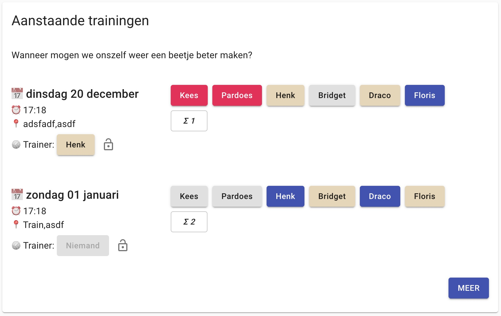
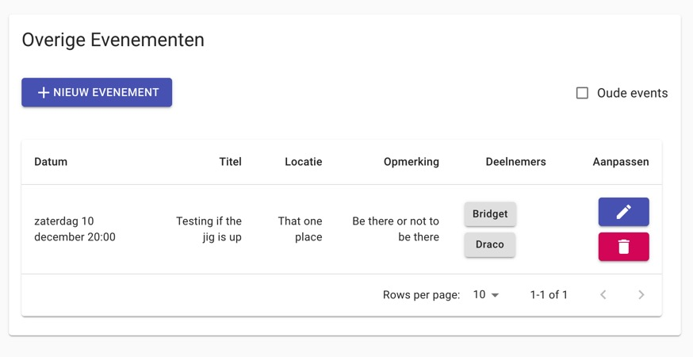
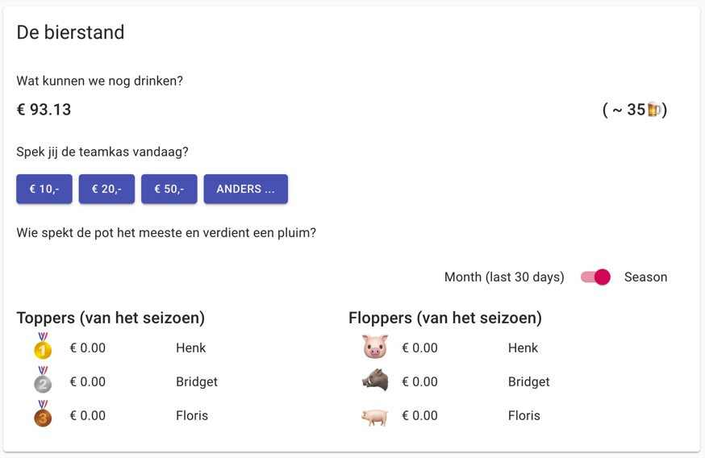

<div align="center">
    <h1>teambalance</h1>
    
    <p>Sports team management: event attendance and a shared money pool (Bunq integration)</p>
</div>

## What it does

Teambalance helps sports teams plan event attendance and manage a shared money pool. Built for
[Tovo Utrecht](https://tovo.nl/) volleyball club, it supports multiple teams via multitenancy
(one team per subdomain). Members track attendance for trainings, matches, and other events, and
chip in to a shared Bunq bank account that covers team expenses.

<div align="center">


</div>

### Money pool (Bunq)

<div align="center">

</div>

The money pool integrates with [bunq](https://www.bunq.com/) and shows:

- Current balance and transaction history
- Top contributors (Hall of Fame) and bottom contributors (Hall of Shame)
- Top-up via bunq.me link (mobile-first)

## Tech stack

| Layer | Technologies |
|-------|-------------|
| **Backend** | Kotlin 2.x, Spring Boot 3.x, Spring Data JPA + JOOQ, Flyway, PostgreSQL, Java 21 |
| **Frontend** | React 18, TypeScript, Vite, MUI v5, React Router v6 |
| **API contracts** | [Wirespec](https://wirespec.dev/) — generates Kotlin + TypeScript types |
| **Build** | Maven (`./mvnw`), multi-module |
| **Infra (prod)** | Google Cloud Run, GCP Container Registry |
| **Infra (local)** | Docker Compose |
| **E2E tests** | Playwright (via Docker Compose) |

## Prerequisites

- Java 21+
- Docker & Docker Compose
- Maven (or use the `./mvnw` wrapper)
- Add to `/etc/hosts`:
  ```
  127.0.0.1  4.teambalance.local
  127.0.0.1  5.teambalance.local
  ```
  (Required — teambalance resolves the tenant from the subdomain)

## Quick start (local)

```bash
# Start backend + frontend + PostgreSQL
make run-local

# Open the app
open http://4.teambalance.local:5173
```

Seed sample data (events, users, transactions) after the backend is up:

```bash
make test
# admin UI: username=admin password=admin
# frontend: password=teambalance
```

## Key commands

| Command | What it does |
|---------|-------------|
| `make build` | Full build with formatting (`./mvnw install -Pformat`) |
| `make yolo` | Fast compile — skips tests and lint |
| `make format` | Format code (`./mvnw process-sources -Pformat`) |
| `make test` | Seed test data against a running local backend |
| `make e2e` | Run Playwright e2e tests via Docker Compose |
| `make ci` | Full CI build including SonarCloud analysis |
| `make db` | Start PostgreSQL only |
| `make run-local` | Start backend + frontend via Docker Compose |
| `make run-local-backend` | Start backend only |
| `make run-local-frontend` | Start frontend only |
| `make clean` | Clean build artifacts and stop Docker containers |

## Project layout

```
teambalance/
├── backend/                  # Kotlin / Spring Boot service
│   └── src/main/kotlin/nl/jvandis/teambalance/
│       └── api/              # REST controllers, services, repos (per domain)
├── frontend/                 # React SPA
│   └── src/main/react/src/   # TypeScript source
├── e2e/                      # Playwright end-to-end tests
│   └── src/playwright/
├── test-data/                # Spring Boot CLI — seeds sample data
├── jooq-support/             # JOOQ code generation module
└── compose.yml               # Docker Compose (local dev + e2e)
```

## Domain routing

| URL | Target |
|-----|--------|
| `teambalance.app` | Landing page |
| `app.teambalance.app` | React SPA |
| `api.teambalance.app` | REST API |
| `4.teambalance.local` / `5.teambalance.local` | Local dev (two teams) |

## Testing

- **Backend**: JUnit 5 + MockK (unit and integration tests in `backend/src/test/kotlin/`)
- **Frontend**: No unit tests currently
- **E2E**: Playwright — run with `make e2e`
- **Test data**: `make test` seeds a running local backend with sample data

## Deployment

Pushing to `master` triggers the [GCP workflow](.github/workflows/gcp.yml), which builds a Docker
image with [Jib](https://github.com/GoogleContainerTools/jib) and pushes it to GCP Container
Registry. Deployments are managed via [Google Cloud Run](https://console.cloud.google.com/run).

## Troubleshooting

- **Port already in use** — run `make clean` to stop all containers
- **Tenant not recognised** — confirm `/etc/hosts` maps `4.teambalance.local` to `127.0.0.1`
- **Database migration failed** — check Flyway SQL in `backend/src/main/resources/db/migration/`
- **Build hangs on JOOQ generation** — normal; can take 1–2 minutes for large schemas
